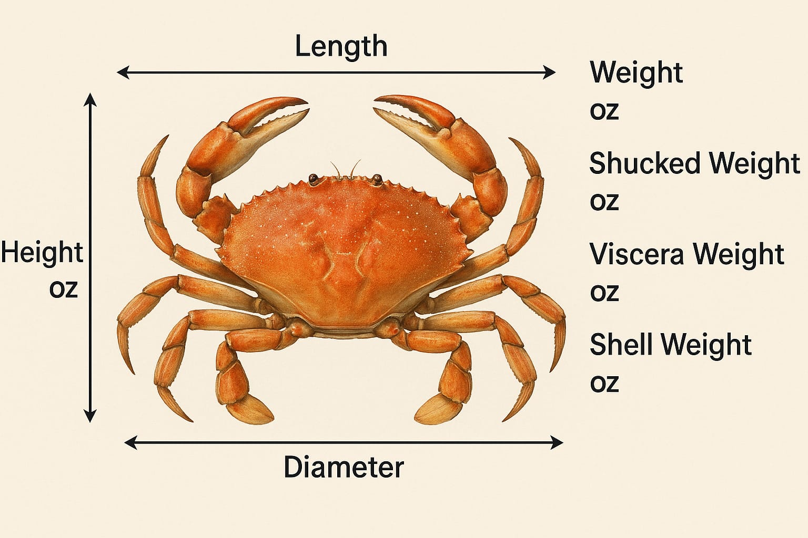
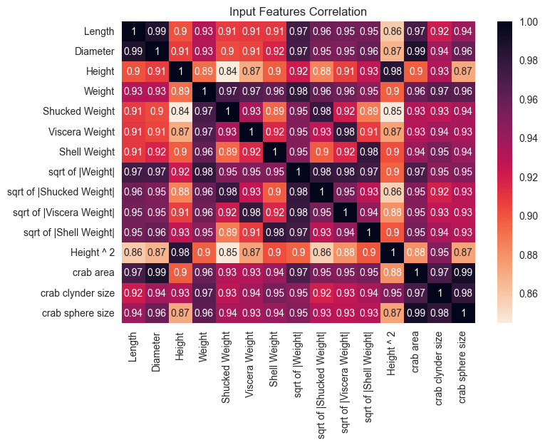
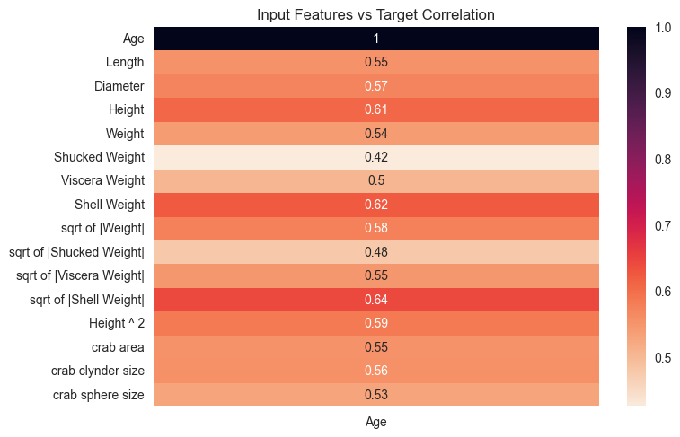
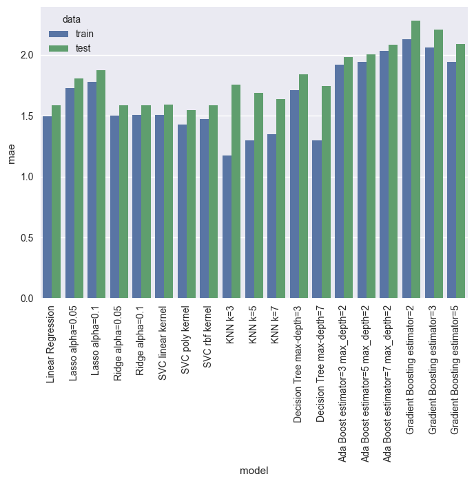

## 🦀 **Crab Age Prediction - Project Overview**

### 🎯 **Objective**

Predict the **age of crabs** (in months) using physical attributes. This is a **regression task**, where the target is `Age`.

### 🧠 **Motivation**

Accurately predicting crab age helps:

* Optimize **harvesting time**
* Reduce **operational costs**
* Maximize **profits** in crab farming industries

---

## 📊 *Dataset Features Explained*

The dataset includes various *physical measurements* of crabs, with the goal of predicting their *age*:

| Feature          | Description                                                              |
| ---------------- |--------------------------------------------------------------------------|
| Sex            | Categorical: 'M' (Male), 'F' (Female), 'I' (Indeterminate)                     |
| Length         | Longest shell length (in mm)                                             |
| Diameter       | Perpendicular to length (in mm)                                          |
| Height         | Height of the whole crab (in mm)                                         |
| Weight         | Whole weight of the crab (in grams)                                      |
| Shucked Weight | Weight of meat (in grams)                                                |
| Viscera Weight | Gut weight (in grams)                                                    |
| Shell Weight   | Weight of shell after drying (in grams)                                  |
| Age            | *Target variable*, estimated from the number of growth rings (in months) |

---

## 🧹 *Preprocessing Steps*

This section ensures the dataset is clean and ready for modeling:

1. *Null Handling*

   * Checked for missing values using df.isnull().sum()
   * If any were present, they would be handled by dropping or imputing.

2. *Data Type Correction*

   * Converted numerical columns to float type to ensure proper mathematical operations.

3. *Outlier Removal*

   * Used *boxplots* and *statistical thresholds* to remove extreme values:

     * Values beyond 1.5 \* IQR from Q1 and Q3 were considered outliers.
   * Outliers were removed using filtering to avoid skewing the model.

4. *Encoding Categorical Feature*

   * Sex was converted using *One-Hot Encoding*, resulting in three binary columns: Sex_F, Sex_I, Sex_M.

5. *Feature Scaling*

   * Normalized continuous features using MinMaxScaler to bring values to the range [0, 1].
   * This improves model convergence, especially for KNN and SVM.

---

## 🔎 *Feature Engineering*

To boost performance, you created new meaningful features from the existing ones:

* sqrt(abs(weight)): Scales down skewed weight data
* height²: Captures non-linear relation
* crab_area = 4π × diameter²: Approximates surface area
* cylinder_size = area × height: Estimates volume
* sphere_size = (4/3)π × diameter³: Another volume approximation

---

## 📈 *Feature Correlation Analysis*

To understand how features relate to the target (Age), a *correlation heatmap* was generated.

*Key points:*

* Strongest correlations:

  * Length, Diameter, Height, and Weight positively correlated with Age
* Weak or negative correlations:

  * Shell Weight, Viscera Weight, and sometimes Sex_F/I had low influence
* This analysis helped with *feature selection* and *engineering*

---

## ✂ *Data Splitting*

The dataset was split into:

* *Training set (70%)*
* *Testing set (30%)*

This ensures the model is trained on one portion and evaluated on unseen data for realistic performance measurement.

---

## 🧪 **Model Training & Evaluation**

### 📈 **Evaluation Metrics**

For each model, the following metrics were recorded:

* **MSE** (Mean Squared Error): Lower is better
* **MAE** (Mean Absolute Error): Lower is better
* **R² Score**: Closer to 1 is better

---

### 🔝 **Top Model Summary**

| Model                           | Data  | MSE      | MAE      | R² Score  |
| ------------------------------- | ----- | -------- | -------- | --------- |
| **SVR (poly kernel)**           | Train | 4.29     | 1.43     | 0.564     |
| SVR (poly kernel)               | Test  | 5.34     | 1.55     | 0.539     |
| **Linear Regression**           | Train | 4.31     | 1.50     | 0.562     |
| Linear Regression               | Test  | 5.09     | 1.58     | 0.561     |
| **Decision Tree (max-depth=7)** | Train | 3.36     | 1.30     | 0.659     |
| Decision Tree (max-depth=7)     | Test  | 6.65     | 1.75     | 0.426     |
| *KNN (k=3)*                   | Train | *2.75* | *1.17* | *0.721* |
| KNN (k=3)                       | Test  | 6.33     | 1.75     | 0.454     |
and more evaluations shown in images
---

### 📉 **Poor Performing Models**

| Model                            | R² Score (Test) |
| -------------------------------- | --------------- |
| Gradient Boosting (estimators=2) | **0.136**       |
| AdaBoost (estimators=7)          | **0.376**       |
| Lasso (alpha=0.1)                | **0.393**       |

---

### 📌 **Insights**

* **KNN (k=3)** gave the best performance on the training set but may **overfit**, as its test R² dropped.
* **Linear Regression** gave **balanced performance** and generalization.
* **Decision Trees** performed well when deeper, but deeper trees may still overfit.
* **Ensemble methods (AdaBoost, GB)** underperformed—likely due to needing hyperparameter tuning or more depth.

---

## 🚀 Demo

🔗 [Click here to try the demo](https://crabageprediction-githappxxfxuojnwsqumwjp.streamlit.app/)
---

## 📸 Screenshots

---

## ✅ **Conclusion**

This project explored several regression models for predicting crab age using physical attributes. The best overall models were:

* **KNN (k=3)** for lowest training error
* **Linear Regression** for generalization
* **SVR (poly)** for balanced accuracy